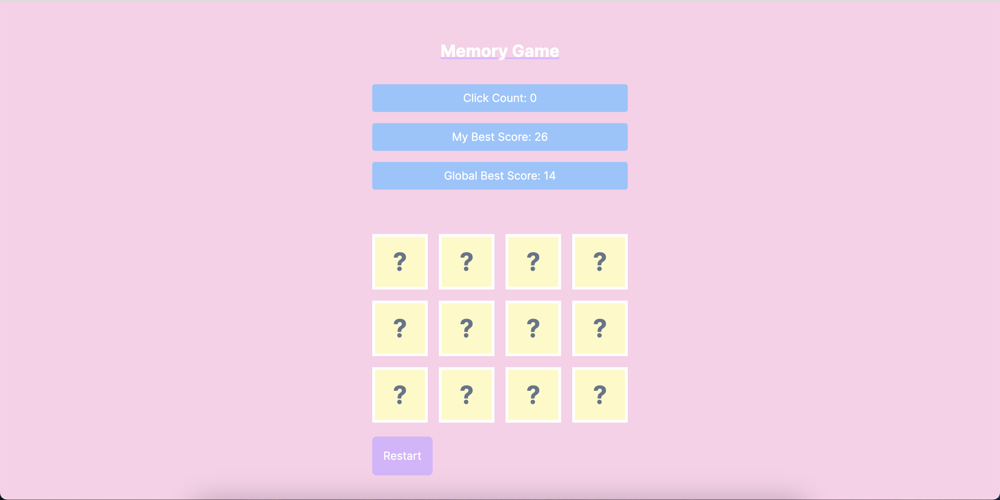

## Memory Game



## Game Description
Memory Game is a simple card game which consisted of a total of 12 cards. It is made out of two set of 6 different types of fruits. The main goal of the game is to match the two identical cards. If you successfully match all identical card you win. Your best score and the global best score will be visible to you at all time. You can view the amount of click you have made for that round. You can always click restart to reset the game. 

## You can find released game here

```https://memory-game-sand-nine.vercel.app/```

## Installation

To install project locally, make sure to have NodeJS (version 16.13.0 at least) and Yarn (version 1.22.17 at least) installed.


* Clone the project 
```bash 
git clone https://github.com/jittaearn/MemoryGame.git
```
* Enter project 
```bash 
cd MemoryGame/
```
* Install dependencies 
```bash 
yarn install
```
* Start dev environment 
```bash 
yarn dev
```

## Stack

### Yarn Workspaces

Project makes use of Yarn `workspaces` to manage client and server projects but also to share some code between both.

### Next.js 

Client application is built on top of Next.js.

### Vercel

Deployment via Vercel.


